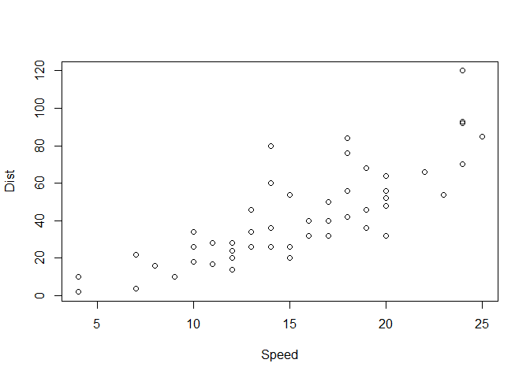

<!-- README.md is generated from README.Rmd. Please edit that file -->

**NOTE: This is work in progress.**

# gooddays

<!-- badges: start -->
<!-- badges: end -->

The goal of the package is to provide convenience functions for simple
tasks that may be useful.

## Installation

You can install the development version of gooddays from
[GitHub](https://github.com/) with:

``` r
# install.packages("devtools")
devtools::install_github("mshmandal/gooddays")
```

## Usage

To split strings as vectors

``` r
# load the package
library(gooddays)

# pass a string and split parameter based on which to split 
gd_split("ka,sui,moku",split=",")
#> [1] "ka"   "sui"  "moku"

# another example
gd_split("hello.world",split="\\.")
#> [1] "hello" "world"
```

Convert a string to capitalize each word. Note this is just a wrapper
for ‘tools::toTitleCase()’. The goal here is to gather and write such
common convenience functions for repeated use.

``` r
library(gooddays)
gd_title("hello world")
#> [1] "Hello World"

# which can be done by tools::toTitleCase() function
tools::toTitleCase("hello world")
#> [1] "Hello World"

# trivial example
data(cars)

plot(
  cars,
  xlab=gd_title(names(cars)[1]),
  ylab=gd_title(names(cars)[2])
  )
```


